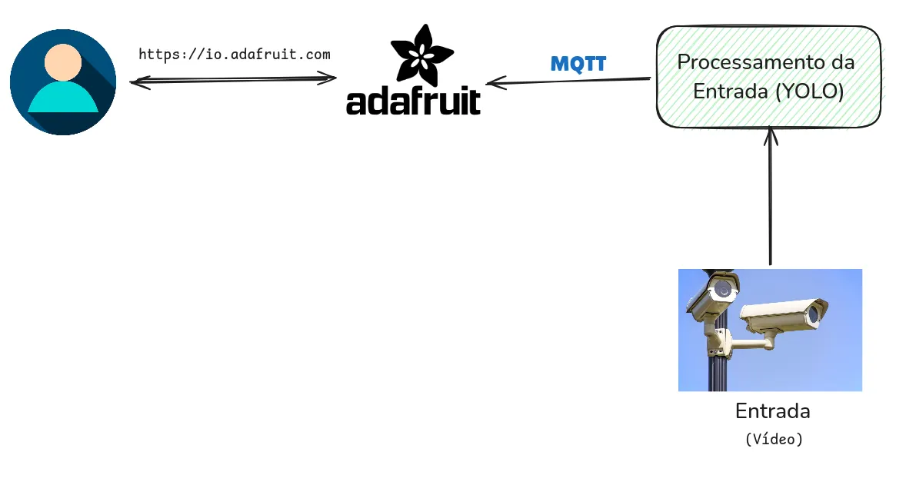

# Sistema Inteligente de Monitoramento de Veículos

## Descrição

Este projeto consiste em um sistema inteligente para monitoramento de tráfego de veículos, com a capacidade de detectar e classificar diferentes tipos de veículos, incluindo carros, motocicletas e caminhões. O sistema coleta dados em tempo real e os envia para uma central de eventos, permitindo que profissionais acompanhem e analisem o tráfego em pontos específicos de interesse.

### Tecnologias Utilizadas

- **OpenCV**: Biblioteca de visão computacional utilizada para processar e manipular imagens e vídeos, facilitando a identificação de objetos no tráfego.
- **YOLO (You Only Look Once)**: Modelo de detecção de objetos em tempo real, responsável por identificar e classificar veículos de forma eficiente.
- **Python**: Linguagem de programação principal do projeto, utilizada para integrar os componentes e implementar a lógica de detecção e envio de dados.
- **MQTT (Message Queuing Telemetry Transport)**: Protocolo leve de comunicação, essencial para o envio eficiente de mensagens em tempo real entre dispositivos IoT.
- **Adafruit IO**: Plataforma IoT utilizada para gerenciar e visualizar os dados coletados, fornecendo uma interface amigável para monitoramento remoto e análises.

---

## Arquitetura



A arquitetura do sistema é composta por:

1. **Câmera de monitoramento/Vídeo**: Responsável pela captura de imagens/vídeos do tráfego.
2. **Módulo de processamento local**: Utiliza OpenCV e YOLO para detectar e classificar os veículos.
3. **MQTT Broker**: Facilita a comunicação entre os módulos do sistema.
4. **Plataforma Adafruit IO**: Exibe os dados processados em dashboards para análise e monitoramento remoto.

---

## Configuração e Execução

### Requisitos

- Python 3.8 ou superior
- OpenCV
- YOLOv4 (ou superior)
- Cliente MQTT (p. ex.: `paho-mqtt`)
- Conta no [Adafruit IO](https://io.adafruit.com/)

### Instalação

1. Clone o repositório:

   ```bash
   git clone https://github.com/pedrolucas27/vehicle-detector.git
   cd vehicle-detector
   ```

2. Instale as dependências:

   ```bash
   pip install -r requirements.txt
   ```

3. No arquivo, `mqtt/client.py` configure as credenciais do Adafruit IO e MQTT:
   ```env
   AIO_KEY=seu_key
   USERNAME=seu_usuario
   MQTT_BROKER=seu_broker
   MQTT_PORT=seu_port
   ```

Obs.: Em uma futura atualização, essas credenciais serão armazenadas em um arquivo `.env`.

### Execução

1. Inicie o sistema de monitoramento:

   ```bash
   python3 src/main.py
   ```

2. Acesse o dashboard do Adafruit IO para visualizar os dados em tempo real.
